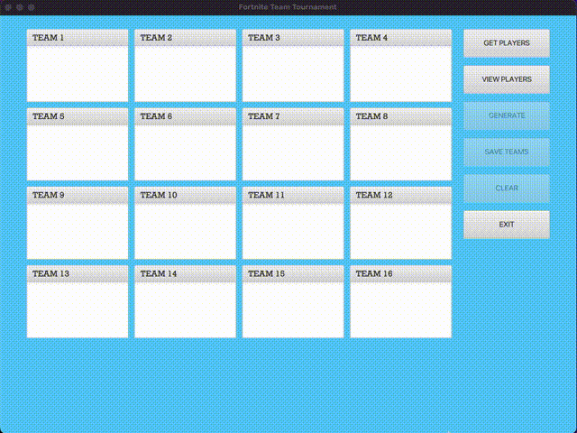
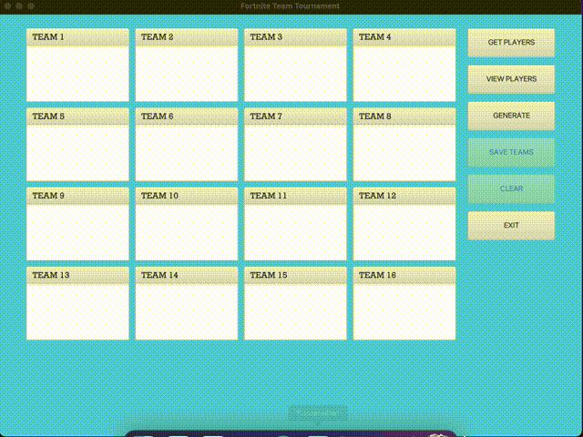
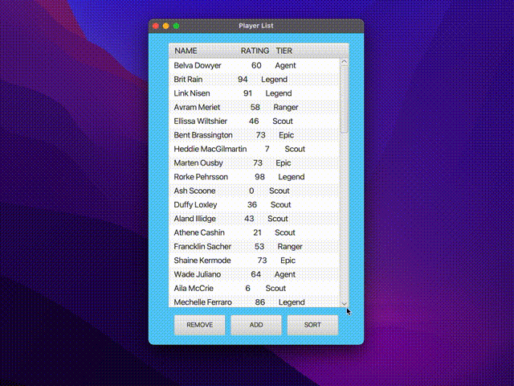
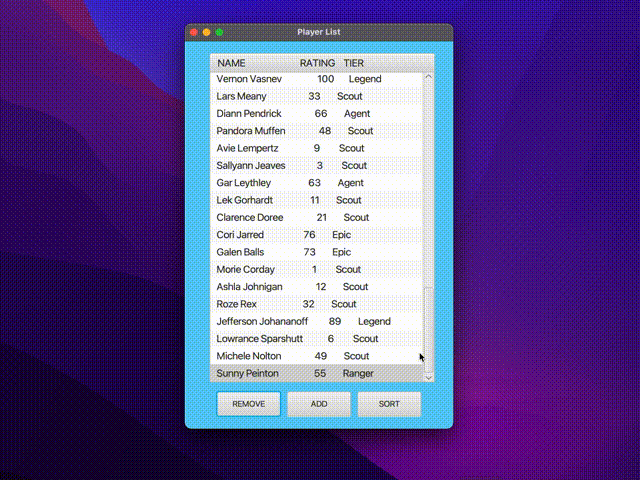
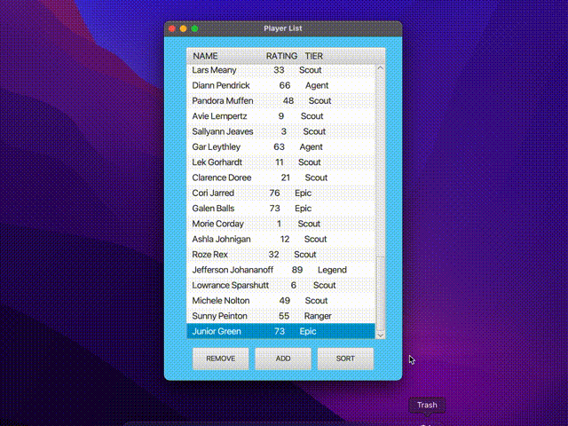
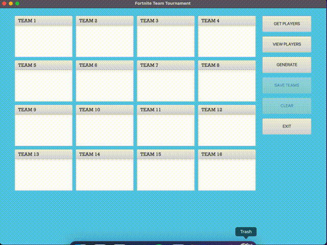
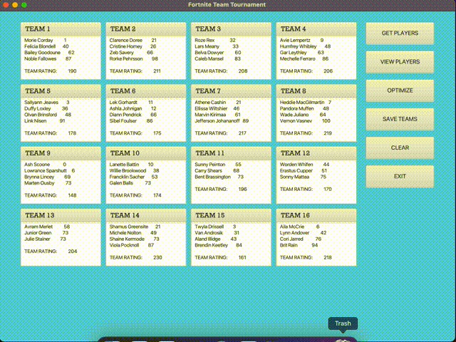

# Fortnite-Team-Generator
Interactive GUI that takes in a comma delimited text file that contains player information inlcuding name and rank. Creates optimally balanced teams where teams formed are all around a similiar average in terms of rank. 

# Instructions/Notes

When asked to locate file when you press "Get Players" locate "players.txt" in project directory

# Contributers
Junior Green<<juniorgreen@cmail.carleton.ca>>

# Gallery
**Get players from text file**

**View players in list format**

**Remove player in list**

**Add player to list**

**Sort alphabetically or by rank**

**Optimize teams**

**Save teams to formatted doc file**

